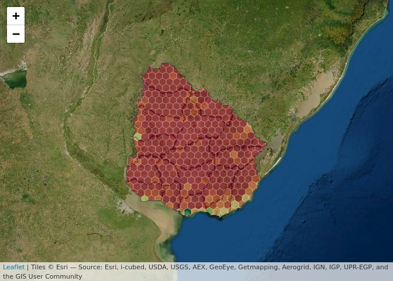

    Uruguay <- 
      geouy::load_geouy(c = "Dptos") %>% 
      st_transform(crs = 4326)

------------------------------------------------------------------------

### Visualizador interactivo (experimental!)

Cargar los datos previamente preparados (ver
[iNatUY\_donde\_ir\_a\_registrar](iNatUY_donde_ir_a_registrar.md))

    load('../data/grid_iNatUY_GIS.RData')

Manipular los datos un poco:

    datos <- 
      grid_iNatUY_GIS %>% 
      mutate(indice_prioridad = 
               scales::rescale(temporalIntensity + spatialIntensity, to = 0:1),
             indice_prioridad = replace_na(indice_prioridad, 1)) %>% 
      select(-spsList) %>% 
      st_transform(crs = 4326)

El objeto popup es un vector character con el código HTML

    popup <- paste0("<strong>GridID: </strong>", 
                    datos$grid_ID, 
                    " <strong>Índice de prioridad: </strong>", 
                    round(datos$indice_prioridad, 2))

Objeto (función) para determinar el coloreado de los deptos

    pal <- colorBin(palette = "RdYlGn", 
                    reverse = TRUE,
                    # na.color = "#79002d",
                    domain = datos$indice_prioridad, 
                    bins = 8)

El visualizador (widget)

    leaflet() %>%
      addProviderTiles(providers$Esri.WorldImagery,
                       options = providerTileOptions(noWrap = TRUE)) %>% 
      clearBounds() %>% 
      addPolygons(
        data = st_transform(Uruguay, crs = 4326), 
        fillColor = NA, 
        weight = 2, 
        color = 'black',
        fillOpacity = 0,
      ) %>% 
      addPolygons(
        data = datos,
        weight = .5, 
        color = 'white',
        fillColor = ~pal(indice_prioridad),
        fillOpacity = .5,
        popup = popup,
        highlightOptions = highlightOptions(color = "white", 
                                            weight = 2, 
                                            bringToFront = TRUE)
      )

