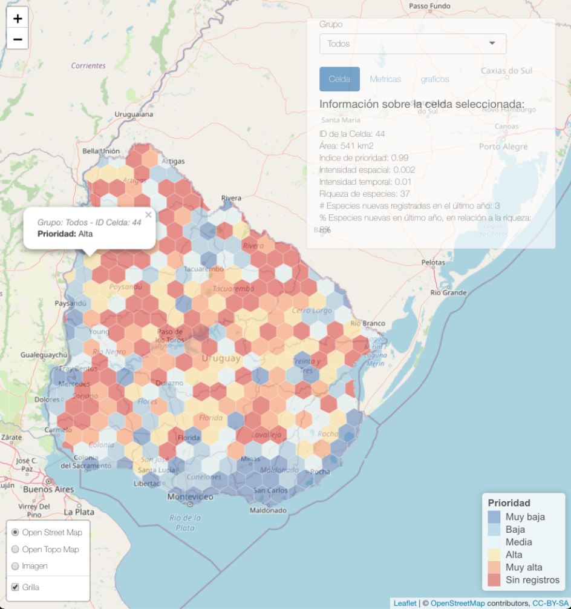

```{r setup, include=FALSE}
knitr::opts_chunk$set(echo = F)
library(knitr)
```

**Florencia Grattarola**^1,2^, **Juan Manuel Barreneche**^2^ 

1 JULANA ONG, Alarcón 1392, 11300, Montevideo, Uruguay  
2 Faculty of Environmental Sciences, Czech University of Life Sciences Prague, Kamýcká 129, Praha-Suchdol, 165 00, Czech Republic  

**Keywords**: biodiversidad, ciencia ciudadana, iNaturalist, vacíos de información, informática de la biodiversidad, Uruguay.  

La biodiversidad a nivel global está disminuyendo a un ritmo sin precedentes. En este contexto, uno de los principales desafíos que enfrentan los países alrededor del mundo es poder medir cuantitativamente la biodiversidad y monitorear sus cambios. Sin embargo, en diversas regiones de Latinoamérica y el Caribe los datos de biodiversidad disponibles de manera abierta son limitados. Para poder tomar mejores decisiones basadas en evidencia es sumamente crítico revertir la falta de datos primarios sobre la distribución geográfica de las especies. Para esto, la ciencia ciudadana se presenta como una herramienta comunitaria transformadora. Una de las plataformas globales más usadas en Latinoamérica y el mundo es iNaturalist ([inaturalist.org](https://www.inaturalist.org)). Esta plataforma web y aplicación para celulares tiene como principal funcionalidad el registro de organismos en el tiempo y el espacio y reúne, en torno a estos datos, a la comunidad de naturalistas más grande del mundo. Una característica de los datos que provienen de la ciencia ciudadana es que suelen centrarse en áreas de fácil acceso y próximas a centros poblados, carreteras y áreas de interés (como por ejemplo, áreas protegidas). Para poder generar datos más diversos y mejorar el conocimiento de la biodiversidad, quienes observan (y quienes usan los datos) se verían muy beneficiados de tener a disposición una herramienta que les permita decidir a dónde ir a registrar organismos y qué grupos observar en función de maximizar su aporte.    

Usando como base los datos ingresados en la plataforma iNaturalist para Uruguay (descargados el 21 de octubre de 2021), nos propusimos generar un mapa interactivo que ordene las áreas con déficit de datos de biodiversidad y nos permita resaltar aquellas en las que registros adicionales de biodiversidad podrían ser particularmente valiosos para llenar los vacíos de conocimiento. Una vez descargados los datos, filtramos los registros de organismos cautivos o cultivados, los que no habían sido identificados con grado de investigación y aquellos con coordenadas obscurecidas, y nos quedamos con las observaciones identificadas a nivel taxonómico de especie, pasando de 28,215 registros a 17,398 (61.7% del total). Luego, dividimos el país en grillas hexagonales de 500km^2^ y calculamos una serie de métricas por grilla (intensidad espacial y temporal), usando los paquetes `geouy`, `sf` y `tidyverse`, para luego integrarlas en una medida de prioridad. Intensidad espacial fue calculada como la cantidad de registros por unidad de área, e intensidad temporal como la cantidad de registros por cada mes/año de registro. Ambas métricas fueron re-escaladas entre 0 y 1, sumadas y vueltas a re-escalar para generar nuestro índice de prioridad. Finalmente, las grillas fueron categorizados como de prioridad ‘Muy Alta’, ‘Alta’, ‘Media’, ‘Baja’, ‘Muy Baja’, y ‘Sin registros’, en función de cada grupo taxonómico. El sistema de puntaje de prioridad construido, no es absoluto sino relativo al conjunto de celdas. De esta manera, siempre será posible encontrar celdas con mayor o menor oportunidad de hacer aportes valiosos. Los datos fueron luego usados como base para crear una app en Shiny, usando los paquetes `shiny` y `leaflet`. La app permite visualizar el mapa de Uruguay con las grillas hexagonales coloreadas según el orden de prioridad generado (Figura 1). Además, quienes consulten el mapa podrán seleccionar el grupo taxonómico de interés y elegir una grilla, para la cual se desplegará información sobre: el área de la grilla, los valores de intensidad espacial y temporal, la cantidad de especies registradas para esa grilla, el número de especies nuevas registradas en el último año y la proporción de éstas sobre el total registrado para esa grilla.  

Haciendo uso de esta herramienta, usuarios y usuarias de la plataforma iNaturalist podrán decidir el destino de sus paseos en función de dónde registrar observaciones de la biodiversidad es más urgente y así contribuir a mejorar el conocimiento sobre la distribución de especies en el país. Esta herramienta podría replicarse en otras partes del mundo, además, nuevas métricas podrían ser propuestas y formas de visualizar los datos acordes a las regiones (e.g. resaltando rutas, áreas administrativas o zonas de interés). Esta es la primera vez que hacemos pública la herramienta por lo que esperamos poder recibir devoluciones para seguirla mejorando a futuro.     


**El código (incluido el de la Shiny app) puede encontrarse aquí**: [https://github.com/bienflorencia/LatinR2021](https://github.com/bienflorencia/LatinR2021)    

```{r image_all, fig.cap="Visualización de la Shiny app", out.width = "75%", fig.align = "center"}

```
