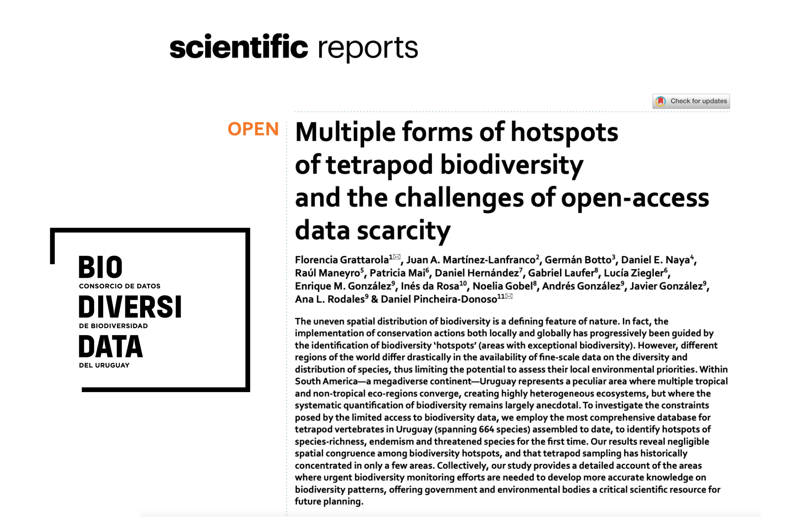
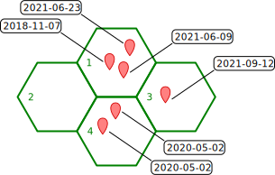
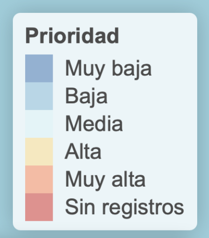

class: chapter-slide

# ¿Por qué hacer este proyecto?

---

## Datos abiertos en un contexto de crisis de la biodiversidad

La biodiversidad a nivel global está disminuyendo a un ritmo sin precedentes.  

--

Para poder evaluar estos cambios hay cada vez más datos disponibles abiertamente en todo el mundo.
--

* Digitalización de especímenes de museo  
--

* Cámaras trampa  
--

* Registradores de datos acústicos (e.j. Audiomoth)  
--

* ADN ambiental  
--

* Ciencia comunitaria  

---

class: middle, center

### Sin embargo, en diversas regiones de Latinoamérica y el Caribe los datos de biodiversidad disponibles de manera abierta son limitados

---

class: middle, center

```{r, echo=FALSE,warning=FALSE,message=FALSE,fig.show="hold",out.width="20%", fig.alt="Logo de GBIF"}
knitr::include_graphics("figs/GBIF-2015-full.tif")
```
```{r, echo=FALSE,warning=FALSE,message=FALSE,fig.show="hold",out.width="100%", fig.alt="Se muestran un mapa global con la acumulación de datos disponibles en la plataforma GBIF. El mapa muestra que la acumulación de datos de biodiversidad en ciertas zonas del mundo es mayor (en rojo) y que, en otras zonas, la acumulación es menor (en verde). Por ejemplo, en partes de Sudamérica."}
knitr::include_graphics("figs/GBIF_global_data.png")
```

---

Tal es el caso de Uruguay, en donde el 95% de su territorio permanece con muestreos insuficientes.

```{r, echo=FALSE, fig.align='center', fig.show="hold",out.width="70%", fig.alt="La figura muestra un árticulo publicado en Scientific Reports bajo el título Múltiples tipos de hotspots de biodiversidad de tetrápodos y los retos de la escasez de datos de acceso abierto."}

```

---

## Datos abiertos en un contexto de crisis de la biodiversidad

Para poder tomar mejores decisiones basadas en evidencia es sumamente crítico revertir la falta de datos primarios sobre la distribución geográfica de las especies.  
--


Para esto, la **ciencia comunitaria** se presenta como una herramienta colectiva transformadora.

---

## Ciencia comunitaria

Investigación **comunitaria** mediante la recolección, el análisis y la interpretación de datos, y la **integración de saberes**, para la generación de **nuevos conocimientos** y la creación de **oportunidades de aprendizaje**.

---

class: middle, center

```{r, echo=FALSE,warning=FALSE,message=FALSE,fig.show="hold",out.width="60%", fig.alt="Logo de iNaturalist"}
knitr::include_graphics("figs/iNaturalist-Identity.png")
```

[www.inaturalist.org](https://www.inaturalist.org)

---

## iNaturalist

Esta plataforma web y aplicación para celulares, tiene como principal funcionalidad el registro de **organismos** en el **tiempo** y el **espacio** y reúne, en torno a estos datos, a la comunidad de naturalistas más grande del mundo.  

--

 Busca:   

* Acercar a las personas a la naturaleza, su observación y conocimiento.  
--

* Contribuir con la generación de datos de biodiversidad de calidad para su uso por parte de diferentes comunidades.  

---

## Sesgos observacionales 

Los datos que provienen de la ciencia comunitaria suelen orginarse en áreas de fácil acceso y próximas a centros poblados, carreteras y áreas de interés (como, por ejemplo, áreas protegidas).

--

Para poder generar datos más diversos y mejorar el conocimiento de la biodiversidad, quienes observan (y quienes usan los datos) se verían muy beneficiados de tener a disposición una herramienta que les permita decidir **a dónde ir a registrar organismos y qué grupos observar en función de maximizar su aporte**.

---

class: chapter-slide

# Objetivo

---

# Objetivo

Generar un mapa interactivo del Uruguay que categorice áreas según su **déficit de datos de biodiversidad** y nos permita resaltar aquellas en las que registros adicionales de biodiversidad podrían ser particularmente valiosos para **llenar los vacíos de conocimiento**.


---

class: chapter-slide

# ¿Cómo lo hicimos?

---

## Datos de biodiversidad

Usamos como base los datos ingresados en la plataforma iNaturalist para Uruguay hasta el **21 de octubre de 2021**.

---

## Datos de biodiversidad
```{r, echo=FALSE, warning=FALSE, message=FALSE, out.height="80%"}
library(tidyverse)
library(kableExtra)

iNatUY  <- read_csv('../../data/observations-193326.csv', guess_max = 29000)

iNatUY %>% 
  select(observed_on,
         license, 
         url,
         taxon_id,
         scientific_name, 
         common_name,
         class = taxon_class_name, 
         order = taxon_order_name, 
         family = taxon_family_name, 
         genus = taxon_genus_name, 
         species= taxon_species_name,
         latitude, 
         longitude,
         captive_cultivated,
         coordinates_obscured,
         quality_grade, 
         iconic_taxon_name) %>% 
  slice_head(n=100) %>% 
  kableExtra::kbl(booktabs = T, escape = F, format = "html", longtable = T) %>% 
  kableExtra::kable_styling(
   latex_options = c("hold_position", "repeat_header", "striped"),
   font_size = 13) %>%
  kableExtra::scroll_box(width = "1000px", height = "400px")

```


---

## Datos de biodiversidad

```{r, warning=FALSE, message=FALSE, out.height="60%", out.width="60%"}
iNatUY_filtro <- iNatUY %>% 
  dplyr::filter(captive_cultivated == FALSE,
         coordinates_obscured == FALSE,
         quality_grade=='research',
         !is.na(taxon_species_name) & !is.na(iconic_taxon_name))
```

--
Eliminamos aquellos registros:
  * de organismos **cautivos** o **cultivados**

--
  * con **coordenadas oscurecidas**

---

## Datos de biodiversidad

```{r, warning=FALSE, message=FALSE, out.height="60%", out.width="60%"}
iNatUY_filtro <- iNatUY %>% 
  dplyr::filter(captive_cultivated == FALSE,
         coordinates_obscured == FALSE,
         quality_grade=='research',
         !is.na(taxon_species_name) & !is.na(iconic_taxon_name))
```

Y nos quedamos con los registros: 
  * identificados con **Grado de investigación**  

--
  * identificados a nivel de **especie**.

---

## Datos de biodiversidad

```{r, out.height="60%"}
nrow(iNatUY) # datos totales
nrow(iNatUY_filtro) # datos analizados
```

--

#### Porcentaje de datos retenidos sobre el total de datos:
```{r, echo=FALSE,out.height="60%"}
nrow(iNatUY_filtro)*100/nrow(iNatUY) 
```

---

## Mapa base y celdas

Descargamos el mapa de Uruguay usando el paquete `geouy`.

```r
Uruguay <- geouy::load_geouy(c = "Dptos")
```

--

Y luego dividimos el país en celdas hexagonales de 500 $km^2$ usando los paquetes `sf` y `dplyr`.

```r
grid_Uruguay <- 
  sf::st_make_grid(x = Uruguay, cellsize = 24028.11413, square = F)  %>% 
  sf::st_intersection(., sf::st_union(Uruguay)) %>% sf::st_as_sf() %>% 
  dplyr::mutate(grid_id = 1:nrow(.), area = sf::st_area(x))
```
---

class: middle, center

```{r, echo=FALSE, fig.align='center', fig.height=4, dpi=100, fig.alt="La figura muestra el mapa de Uruguay y las celdas de 500 kilometros cuadrados"}
grids <- readRDS('../../iNatUy_priority_map/data/grid_Uruguay.rds')
ggplot() + geom_sf(data=grids, fill='white') + theme_bw()
```

Celdas de 500 $km^2$ 

---

## Métricas utilizadas

Calculamos una serie de métricas por celda, usando el paquete `sf`:

--

 * **Intensidad espacial**  
 
 * **Intensidad temporal**  

--

Y luego las integramos en un:

 * **Índice de Prioridad**  

---

## Intensidad espacial

La cantidad de registros por unidad de área.

$$ IE = n_r / A_c $$
En donde $n_r$ y $A_c$ son la cantidad de registros y área para una celda determinada, respectivamente.


---

## Intensidad temporal

La cantidad de registros con **pares año-mes** diferentes.

$$ IT = n_{año.mes} $$

En donde $n_{año.mes}$ es el número de registros con **pares año-mes** diferentes para una celda determinada.

--

Por ejemplo, las fechas 2021-08-09 y 2021-08-31, están en el mismo par año-mes, pero las fechas 2021-08-09 y 2021-09-01 no.

---
class: middle, center

## Ejemplo

```{r, echo=FALSE, fig.show="hold",out.width="70%"}

```

---
## Ejemplo

```{r, echo=FALSE, fig.show="hold", fig.align='center', out.width="40%"}

```
- En la celda 1, tenemos 3 registros, por lo que la IE será 3/área = 0.3 (área = 10 $km^2$).  
--

- En cambio la IT es 2, ya que hay 3 registros pero **sólo hay dos combinaciones año-mes**: 2018-11 y 2021-06

---

## Ejemplo

```{r, echo=FALSE, fig.show="hold", fig.align='center', out.width="40%"}

```

- En la celda 2 tenemos 0 registros, así que tanto IE como IT serán 0.

---
## Ejemplo

```{r, echo=FALSE, fig.show="hold", fig.align='center', out.width="40%"}

```

- En la celda 3 hay un registro, así que: IE = 0.1 e IT = 1

---

## Ejemplo

```{r, echo=FALSE, fig.show="hold", fig.align='center', out.width="40%"}

```

- En la celda 4 hay dos registros del mismo día (y por lo tanto, del mismo año-mes: 2020-05), por lo que IE = 0.2 e IT = 1.

---

## Índice de Prioridad

La idea es combinar ambas medidas de intensidad para obtener un **índice de prioridad global**, que nos permita diferenciar celdas según sus relativas falta o presencia de datos.

---

## Índice de Prioridad

En nuestra app, el IP se calcula con la función `calc_ip`:

```{r}
calc_ip <- function(it, ie, n.reg) {
  # 1. rescalamientos:
  it = scales::rescale(it, to = 0:1)
  ie = scales::rescale(ie, to = 0:1)
  # 2. suma:
  suma <- it + ie
  # 3. ranking
  r <- rank(suma, ties.method = 'min', na.last = TRUE)
  # 4. rescalamiento final (ranking a percentiles):
  out <- scales::rescale(r, to = 1:0)
  return(out)
}
```

---

## Índice de Prioridad

Finalmente, las celdas fueron categorizados según el índice de prioridad, considerando a todas las especies juntas y cada grupo icónico. 

```{r, echo=FALSE, fig.show="hold", fig.align='center', out.width="20%"}

```

---

class: chapter-slide

# Resultados

---

```{r, echo=FALSE}
knitr::include_app("https://bienflorencia.shinyapps.io/iNatUy_priority_map/", height = "600px")
```

[https://bienflorencia.shinyapps.io/iNatUy_priority_map/](https://bienflorencia.shinyapps.io/iNatUy_priority_map/)

---

class: chapter-slide

# A futuro

---

## A futuro

Esta herramienta podría replicarse en otras partes del mundo, además, nuevas métricas podrían ser propuestas y nuevas formas de visualizar los datos acordes a las regiones (e.g. resaltando rutas, áreas administrativas o zonas de interés).   

--

Esta es la primera vez que hacemos pública la herramienta por lo que esperamos poder recibir devoluciones para seguirla mejorando a futuro. 

---

class: middle, center

# ¡GRACIAS!

**Florencia Grattarola** ([@flograttarola](https://twitter.com/flograttarola))  
**Juan Manuel Barreneche** ([@jumanbar](https://twitter.com/eldromedario))

```{r,echo=FALSE,warning=FALSE,message=FALSE,fig.show="hold",out.width="50%",fig.alt="Se muestra el logo de JULANA y de la Czech University of Life Sciences Prague"}
knitr::include_graphics(c("figs/marca-julana-horizontal.svg","figs/CZU_logotype_H_ENG_black.png"))
```

```{r,echo=FALSE,warning=FALSE,message=FALSE,fig.show="hold",out.width="80%",fig.alt="Logo de NaturalistaUY"}

```

---

class: middle, center

```{r,echo=FALSE,warning=FALSE,message=FALSE,fig.show="hold",out.width="80%",fig.alt="Foto de Florencia Grattarola a la izquierda y Juan Manuel Barreneche a la derecha, autores de este trabajo"}
knitr::include_graphics("figs/flo_y_juan.png")
```

---

class: chapter-slide

# Referencias

---

# Referencias

- GBIF Secretariat (2021) Diapositivas de resumen de GBIF [Octubre 2021]. Copenhagen: GBIF Secretariat. https://www.gbif.org/document/81771.  
- Grattarola F. et al. (2020) Multiple forms of hotspots of tetrapod biodiversity and the challenges of open-access data scarcity. Sci Rep 10, 22045. https://doi.org/10.1038/s41598-020-79074-8  
- iNaturalist (2021) Datos descargados [21 Octubre 2021] [www.inaturalist.org](https://www.inaturalist.org)  
- Wickham et al., (2019) Welcome to the tidyverse. Journal of Open Source Software, 4(43), 1686, https://doi.org/10.21105/joss.01686  

---

# Referencias
- Pebesma E. (2018) Simple Features for R: Standardized Support for Spatial Vector Data. The R Journal 10 (1), 439-446, https://doi.org/10.32614/RJ-2018-009  
- Joe Cheng, Bhaskar Karambelkar and Yihui Xie (2021). leaflet: Create Interactive Web Maps with the JavaScript 'Leaflet' Library. R package version 2.0.4.1. https://CRAN.R-project.org/package=leaflet  
- Detomasi R. (2020) geouy: Geographic Information of Uruguay. R package version 0.2.2. https://github.com/RichDeto/geouy  

---

class: middle, center

# ¡Les invitamos a sumarse a iNaturalist para contribuir a mejorar el conocimiento sobre la biodiversidad en nuestra región!
