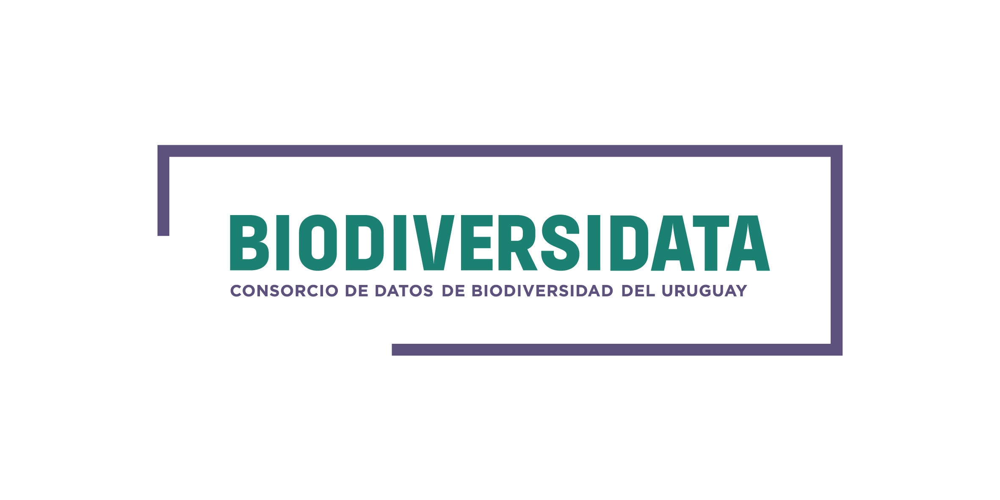
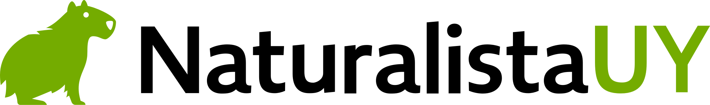

# ¡Escribinos!

Esta herramienta podría replicarse en otras partes del mundo, además, nuevas métricas podrían ser propuestas y nuevas formas de visualizar los datos acordes a las regiones (e.g. resaltando rutas, áreas administrativas o zonas de interés). Esta es la primera vez que hacemos pública la herramienta por lo que esperamos poder recibir devoluciones para seguirla mejorando a futuro.   

 

**Florencia Grattarola** ([@flograttarola](https://twitter.com/flograttarola))  
**Juan Manuel Barreneche** ([@jumanbar](https://twitter.com/eldromedario)) 

 

 
