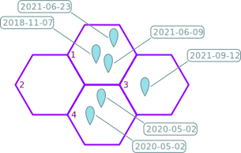

> **NOTA**: esta versión no está terminada. En el momento de escribir me dí cuenta de algunos temas con las intensidades espaciales, temporales, índice de prioridad y los NAs... Eso llevó a muchos cambios en la aplicación, al punto que no he tenido tiempo de actualizar y hacer el fine tunning necesario para este documento.

## Intensidad espacial (prenormalización)

Cantidad de registros por unidad de área.

Es una densidad de registros para la celda.

IE_p = # registros / área de la celda

(la p minúscula indica prenormalización)

## Intensidad temporal

Mide la cantidad de años y meses diferentes presentes en el conjunto de registros:

IT_p = #año_mes diferentes

(la p minúscula indica prenormalización)

El IT es útil porque nos sirve para tener una noción de qué tan sesgados están los datos en cuanto al momento en que fueron tomados. Muchos registros en el mismo día pueden estar sesgados a las especies que en ese momento estaban presentes, o al tipo de registros que las personas decidieron enfocarse, etc. Cuanto más fechas diferentes tengamos en nuestro registro, más probabilidades de que estemos capturando la biodiversidad del lugar.

Decidimos tomar año-mes como unidad de tiempo porque consideramos que es un balance bueno entre complejidad de código y grano de muestreo (en contraste, elegir solamente año puede ser un grano muy grande, debido a que iNaturalist, o la posibilidad de tomar fotos con celulares, venido al caso, existe hace pocos años). No tenemos elementos como para decidir cuál es exactamente el grano más apropiado para el caso de estudio. en caso de existir una mejor alternativa, bien fundamentada, la incorporaremos a los cálculos.

## Ejemplo:

Supongamos que tenemos estas 4 celdas, todas de área = 10 km2, y con un total de 6 registros, cuyas fechas se indican con carteles:



- En la celda 1, tenemos 3 registros, por lo que la IE_p será 3/área = 0.3 (área = 10 km2). En cambio la IT_p es 2, ya que hay 3 registros pero **sólo hay dos combinaciones año-mes**: 2018-11 y 2021-06

- En la celda 2 tenemos 0 registros, así que tanto IE_p como IT_p serán 0. De todas formas, para los cálculos subsiguientes, especialmente los rescalamientos, estos valores serán ignorados. Por esta razón, vamos a asignarle el valor NA ([Not Available](https://www.rdocumentation.org/packages/base/versions/3.6.2/topics/NA)) de momento.

- En la celda 3 hay un registro, así que: IE_p = 0.1; IT_p = 1

- En la celda 4 hay dos registros del mismo día (y por lo tanto, del mismo año-mes: 2020), por lo que IE_p = 0.2 e IT_p = 1.

En una tabla, así se verían los resultados (parciales):

```{r, message=FALSE, echo=TRUE}
library(tidyverse)
tabla_ejemplo <- tibble(Celda = 1:4,
                        n = c(3, 0, 1, 2), 
                        IE_p = c(.3, NA, .1, .2),
                        IT_p = c(2, NA, 1, 1))
# Código para imprimir la tabla:
kableExtra::kbl(tabla_ejemplo) %>%
  kableExtra::kable_styling(full_width = FALSE, bootstrap_options = 'striped')
```

(n = número de registros en cada celda)

## Rescalamientos

La idea es combinar ambas medidas de intensidad para obtener un **índice de prioridad global**, que nos permita diferenciar celdas según sus relativas falta o presencia de datos.

Para hacer esto hay que tener cuidado de **no inflar artificialmente ninguna de las dos intensidades**. Esa inflación puede ocurrir por el simple hecho de que las intensidades se miden en unidades muy diferentes. En el ejmplo dado, vemos que la intensidad temporal toma valores naturalmente mucho más altos que la intensidad espacial, por el simple hecho de que la segunda refiere una la densidad espacial: cantidad de registros sobre área total de la celda (10 km2 en este caso).

Para evitar eso, rescalamos todos los valores al rango [0, 1], usando la función [`rescale`, del paquete `scales`](https://scales.r-lib.org/reference/rescale.html) (más específicamente, nuestro código usa [`scales:::rescale.numeric`](https://github.com/r-lib/scales/blob/9c5a00d66d3536e17f130abf50af9c3a61e1059d/R/bounds.r#L21)).

> Reitermaos aquí que las celdas sin registros se dejan afuera de estos cálculos. Esto es con el fín de que, al final del procesamiento, los valores obtenidos resulten más informativos. En otras palabras, **nos interesa diferenciar celdas con pocos registros de aquellas que no tienen ninguno**.

En concreto, la transformación se puede resumir con la ecuación:

$$ X' = {{ X - X_{min} } \over { X_{max} - X_{min} }} $$

En donde $X'$ es un valor rescalado, $X_{min}$ es el valor mínimoregistrado para el conjunto de todas las celdas (en el ejemplo: 0.1 para IE_p, y 1 para IT_p; recordemos que los valores de la celda 2 quedan afuera de estos cálculos) y $X_{max}$ es el máximo (en el ejemplo: 0.3 para IE_p y 2 para IT_p).

Escrito en código R, sería algo así:

```r
x_rescalado <- (x - min(x)) / (max(x) - min(x))
```

o, en los hechos:

```r
x_rescalado <- scales::rescale(x, to = 0:1)
```

Para el ejemplo anterior, los calculos de rescalamiento se pueden expresar como:

$$ IE = {{ IE_p - 0.1 } \over { 0.3 - 0.1 }} $$
$$ IT = {{ IT_p - 1 } \over { 2 - 1 }} $$

Una vez hechos los rescalamientos, la tabla del ejemplo queda así:

```{r}
tabla_ejemplo_resc <- 
  tabla_ejemplo %>% 
  mutate(IE = scales::rescale(IE_p, to = 0:1),
         IT = scales::rescale(IT_p, to = 0:1))

# Código para imprimir la tabla:
kableExtra::kbl(tabla_ejemplo_resc) %>%
  kableExtra::kable_styling(full_width = FALSE, bootstrap_options = 'striped')

```

## Índice de Prioridad

Ahora sí, habiendo calculado y rescalado las intensidades espacial y temporal, estamos en condiciones de calcular el índice de prioridad (IP).

El mismo es muy sencillo, y consiste en dos pasos: suma de IE + IT y rescalamiento a [0, 1]. El segundo paso es igual a los rescalamientos anteriores, con una diferencia: nos interesa asignar los valores más altos a los casos en los que la intensidad es menor, para darles mayor prioridad. Por lo tanto, el escalamiento será diferente, siguiendo la ecuación: 

$$ X' = {{ X_{max} - X } \over { X_{max} - X_{min} }} $$

En R, simplemente hay que cambiar el argumento `to` de la función [`scales::rescale`](https://scales.r-lib.org/reference/rescale.html): en vez de `to = 0:1`, queda `to = 1:0`...

```r
IP <- scales::rescale(IE + IP, to = 1:0)
```

Siguiendo con el ejemplo, el cálculo de IP se realizará así:

```{r}
tabla_ejemplo_resc_ip <- 
  tabla_ejemplo_resc %>% 
  mutate(IP = scales::rescale(IE + IT, to = 1:0))

# Código para imprimir la tabla
kableExtra::kbl(tabla_ejemplo_resc_ip) %>%
  kableExtra::kable_styling(full_width = FALSE, bootstrap_options = 'striped')
```

Esta tabla ya está casi lista para ser usada en un mapa, a excepción de un detalle: la clasificación en categorías específicas de prioridad: **Alta**, **Media**, **Baja** o **Sin registros**. Para esto lo que necesitamos una regla que sirva para dividir los casos. Las reglas que utilizamos en la aplicación tienen cierta complejidad, así que optamos por docuemntarlas aparte en la sección [colorización de las celdas](colorizacion_celdas.Rmd).

De todas formas, para ilustrar este ejemplo, podemos arbitrariamente decidir que las celdas se van a clasificar según la regla:

- "Baja": cuando el índice de prioridad es menor o igual a 0.2
- "Media": cuando el índice de prioridad es mayor o igual a 0.2 y menor a 0.8
- "Alta": cuando el índice de prioridad es menor a 0.8
- "Sin registros": cuando no hay registros para la celda

A esto le agregamos dos cambios más:

- Las intensidades espacial y temporal de la celda 2, que hasta ahora figuraban como `NA`, pasan a ser 0. Esto sirve para mantener una coerencia con la cantidad de registros y facilitar operaciones matemáticas con estos valores, si es que fuera de interés. Debe notarse, sin embargo, que para los casos específicos de IE e IT, **no da lo mismo tener 0 o `NA` previo a los rescalamientos**.

```{r}
tabla_ejemplo_resc_ip %>%
  mutate(IP = replace_na(IP, 1)) %>%
  mutate(Etiqueta = case_when(
    n == 0 ~ "Sin registros",
    IP <= .2 ~ "Baja",
    .2 < IP & IP <= .8 ~ "Media",
    .8 < IP ~ "Alta"
  )) %>% 
  mutate_at(vars(matches("^I[ET]")), ~ replace_na(0)) %>% 
  # Código para imprimir la tabla:
  kableExtra::kbl() %>%
  kableExtra::kable_styling(full_width = FALSE, bootstrap_options = 'striped')
```


```
to = 0:1

from = range(x)

(x - from[1])/diff(from) * diff(to) + to[1]
```

dado que to = c(0, 1), queda

```
(x - from[1]) / diff(from)
```

que es lo mismo que decir: (x - min(x)) / (max(x) - min(x))

```
  x - min(x)
---------------
max(x) - min(x)
```
