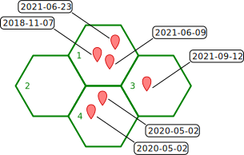

> **NOTA**: esta versión no está terminada. En el momento de escribir me dí cuenta de algunos temas con las intensidades espaciales, temporales, índice de prioridad y los NAs... Eso llevó a muchos cambios en la aplicación, al punto que no he tenido tiempo de actualizar y hacer el fine tunning necesario para este documento.

## Intensidad espacial

Es la cantidad de registros por unidad de área, o dicho de otra forma, una densidad de registros para la celda.

$$ IE = n_r / A_c $$

En donde $n_r$ y $A_c$ son la cantidad de registros y área para una celda determinada, respectivamente.

## Intensidad temporal

Es la cantidad de **pares año-mes** diferentes presentes en el conjunto de registros. Por ejemplo, las fechas 2021-08-09 y 2021-08-31, están en el mismo par año-mes, pero las fechas 2021-08-09 y 2021-09-01 no.

El IT es útil porque nos sirve para tener una noción de qué tan sesgados están los datos en cuanto al momento en que fueron tomados. Muchos registros en el mismo día pueden estar sesgados a las especies que en ese momento estaban presentes, o al tipo de registros que las personas decidieron enfocarse, etc. Cuanto más fechas diferentes tengamos en nuestro registro, más probabilidades de que estemos capturando la biodiversidad del lugar.

La variedad de fechas presentes en el registro puede ser particularmente importante para especies con ciclos de vida corto, como suele pasar con insectos, invertebrados, plantas estacionales (generalizando un poco, especies de pequeño porte).

La decisión de usar los pares año-mes, en lugar de año-mes-día, o año, como unidad de tiempo, se debe a que consideramos que es un buen balance entre complejidad de código y grano de muestreo. En contraste, elegir solamente año puede ser un grano muy grande, debido a que iNaturalist, o la posibilidad de tomar fotos con celulares, venido al caso, existe hace pocos años. A la fecha, no tenemos elementos como para decidir cuál es exactamente el grano más apropiado para el caso de estudio. En caso de existir una mejor alternativa, respaldada por fundamentos, estamos interesades en incorporarla a los cálculos.

## Un ejemplo ilustrativo

Supongamos que tenemos estas 4 celdas, todas de área = 10 km2, y con un total de 6 registros, cuyas fechas son las indicadas:



- En la celda 1, tenemos 3 registros, por lo que la IE será 3/área = 0.3 (área = 10 km2). En cambio la IT es 2, ya que hay 3 registros pero **sólo hay dos combinaciones año-mes**: 2018-11 y 2021-06

- En la celda 2 tenemos 0 registros, así que tanto IE como IT serán 0.

- En la celda 3 hay un registro, así que: IE = 0.1 e IT = 1

- En la celda 4 hay dos registros del mismo día (y por lo tanto, del mismo año-mes: 2020-05), por lo que IE = 0.2 e IT = 1.

En una tabla, así se verían los resultados hasta ahora:

```{r, message=FALSE, echo=TRUE}
library(tidyverse)
tabla_ejemplo <- tibble(Celda = 1:4,
                        n = c(3, 0, 1, 2), 
                        IE = c(.3, 0, .1, .2),
                        IT = c(2, 0, 1, 1))
# Código para imprimir la tabla:
kableExtra::kbl(tabla_ejemplo) %>%
  kableExtra::kable_styling(full_width = FALSE, bootstrap_options = 'striped')
```

(n = número de registros en cada celda)

## Índice de Prioridad

En nuestra app, el IP se calcula con la función `calc_ip`, definida por el código:

<!-- Cambiar ti y si por it e ie? (de inglés a español; pero lo haría en el código original de la función también para ser consistente) --> 

```{r}
calc_ip <- function(ti, si, n.reg) {
  # 1. rescalamientos:
  ti = scales::rescale(ti, to = 0:1)
  si = scales::rescale(si, to = 0:1)
  # 2. suma:
  suma <- ti + si
  # 3. ranking
  r <- rank(suma, ties.method = 'min', na.last = TRUE)
  # 4. sin registros:
  # Para dar mayor prioridad a los que tienen 0 registros (innecesario?)
  r[n.reg == 0] <- 0
  # 5. rescalamiento final (ranking a percentiles):
  out <- scales::rescale(r, to = 1:0)
  return(out)
}
```


# Cómo continuar? Lo que pensé: 
  
  I. explicar la función calc_ip, que hace 5 cosas importates:
    1. rescala IE e IT, para no sobrevalorar ninguna de las dos
    2. Suma IE e IT (suma).
    3. Hace el ranking de esa suma, con ties.method = 'min'; el ranking se puede mapear directamente al porcentaje de valores iguales o menores a una suma determinada... o sea percentiles.
    4. El ranking obtenido (r) tendrá como valor mínimo a 1, naturalmente. En este paso, que tal vez sesa innecesario en realidad, se cambian a 0 los casos en los que hay 1 sólo registro.
    5. Rescalar el ranking obtenido Lo valioso de usar ranking/percentiles, es que suele 'suavizar' la curva de los valores ordenados 
    
  II. contar cómo se hacen las etiquetas 
  
  III. Mostrar tabla final a partir del ejemplo
  
  IV. Capaz que agregar figura final con las celdas coloreadas según etiquetas
  
Algunas cosas ya escritas se pueden reciclar, pero hay otras que están desactualizadas y tienen conceptos obsoletos. En particular, los códigos para imprimir las tablas están bastante buenos.

De acá para abajo habría que revisar todo

- - -

La idea es combinar ambas medidas de intensidad para obtener un **índice de prioridad global**, que nos permita diferenciar celdas según sus relativas falta o presencia de datos.

Para hacer esto hay que tener cuidado de **no inflar artificialmente ninguna de las dos intensidades**. Esa inflación puede ocurrir por el simple hecho de que estas se miden en unidades muy diferentes. En el ejemplo dado, vemos que la intensidad temporal toma valores naturalmente mucho más altos que la intensidad espacial, por el simple hecho de que la segunda refiere una la densidad (cantidad de registros sobre área, 10 km2 en este caso).

Para evitar eso, rescalamos todos los valores al rango [0, 1], usando la función [`rescale`, del paquete `scales`](https://scales.r-lib.org/reference/rescale.html) (más específicamente, nuestro código usa [`scales:::rescale.numeric`](https://github.com/r-lib/scales/blob/9c5a00d66d3536e17f130abf50af9c3a61e1059d/R/bounds.r#L21)).

En concreto, la transformación se puede resumir con la ecuación:

$$ X' = {{ X - X_{min} } \over { X_{max} - X_{min} }} $$

En donde $X'$ es un valor rescalado, $X_{min}$ es el valor mínimo registrado para el conjunto de todas las celdas (en el ejemplo: 0.1 para IE, y 1 para IT; recordemos que los valores de la celda 2 quedan afuera de estos cálculos) y $X_{max}$ es el máximo (en el ejemplo: 0.3 para IE y 2 para IT).

Escrito en código R, sería algo así:

```r
x_rescalado <- (x - min(x)) / (max(x) - min(x))
```

o, en los hechos:

```r
x_rescalado <- scales::rescale(x, to = 0:1)
```

Para el ejemplo anterior, los calculos de rescalamiento se pueden expresar como:

$$ IE_r = {{ IE - 0.1 } \over { 0.3 - 0.1 }} $$
$$ IT_r = {{ IT - 1 } \over { 2 - 1 }} $$

Una vez hechos los rescalamientos, la tabla del ejemplo queda así:

```{r}
tabla_ejemplo_resc <- 
  tabla_ejemplo %>% 
  mutate(IEr = scales::rescale(IE, to = 0:1),
         ITr = scales::rescale(IT, to = 0:1))

# Código para imprimir la tabla:
kableExtra::kbl(tabla_ejemplo_resc) %>%
  kableExtra::kable_styling(full_width = FALSE, bootstrap_options = 'striped')

```

## Índice de Prioridad

Ahora sí, habiendo calculado y rescalado las intensidades espacial y temporal, estamos en condiciones de calcular el índice de prioridad (IP).

El mismo es muy sencillo, y consiste en dos pasos: suma de IE + IT y rescalamiento a [0, 1]. El segundo paso es igual a los rescalamientos anteriores, con una diferencia: nos interesa asignar los valores más altos a los casos en los que la intensidad es menor, para darles mayor prioridad. Por lo tanto, el escalamiento será diferente, siguiendo la ecuación: 

$$ X' = {{ X_{max} - X } \over { X_{max} - X_{min} }} $$

En R, simplemente hay que cambiar el argumento `to` de la función [`scales::rescale`](https://scales.r-lib.org/reference/rescale.html): en vez de `to = 0:1`, queda `to = 1:0`...

```r
IP <- scales::rescale(IE + IP, to = 1:0)
```

Siguiendo con el ejemplo, el cálculo de IP se realizará así:

```{r}
tabla_ejemplo_resc_ip <- 
  tabla_ejemplo_resc %>% 
  mutate(IP = scales::rescale(IE + IT, to = 1:0))

# Código para imprimir la tabla
kableExtra::kbl(tabla_ejemplo_resc_ip) %>%
  kableExtra::kable_styling(full_width = FALSE, bootstrap_options = 'striped')
```

Esta tabla ya está casi lista para ser usada en un mapa, a excepción de un detalle: la clasificación en categorías específicas de prioridad: **Alta**, **Media**, **Baja** o **Sin registros**. Para esto lo que necesitamos una regla que sirva para dividir los casos. Las reglas que utilizamos en la aplicación tienen cierta complejidad, así que optamos por docuemntarlas aparte en la sección [colorización de las celdas](colorizacion_celdas.Rmd).

De todas formas, para ilustrar este ejemplo, podemos arbitrariamente decidir que las celdas se van a clasificar según la regla:

- "Baja": cuando el índice de prioridad es menor o igual a 0.2
- "Media": cuando el índice de prioridad es mayor o igual a 0.2 y menor a 0.8
- "Alta": cuando el índice de prioridad es menor a 0.8
- "Sin registros": cuando no hay registros para la celda

A esto le agregamos dos cambios más:

- Las intensidades espacial y temporal de la celda 2, que hasta ahora figuraban como `NA`, pasan a ser 0. Esto sirve para mantener una coerencia con la cantidad de registros y facilitar operaciones matemáticas con estos valores, si es que fuera de interés. Debe notarse, sin embargo, que para los casos específicos de IE e IT, **no da lo mismo tener 0 o `NA` previo a los rescalamientos**.

```{r}
tabla_ejemplo_resc_ip %>%
  mutate(IP = replace_na(IP, 1)) %>%
  mutate(Etiqueta = case_when(
    n == 0 ~ "Sin registros",
    IP <= .2 ~ "Baja",
    .2 < IP & IP <= .8 ~ "Media",
    .8 < IP ~ "Alta"
  )) %>% 
  mutate_at(vars(matches("^I[ET]")), ~ replace_na(0)) %>% 
  # Código para imprimir la tabla:
  kableExtra::kbl() %>%
  kableExtra::kable_styling(full_width = FALSE, bootstrap_options = 'striped')
```


```
to = 0:1

from = range(x)

(x - from[1])/diff(from) * diff(to) + to[1]
```

dado que to = c(0, 1), queda

```
(x - from[1]) / diff(from)
```

que es lo mismo que decir: (x - min(x)) / (max(x) - min(x))

```
  x - min(x)
---------------
max(x) - min(x)
```
